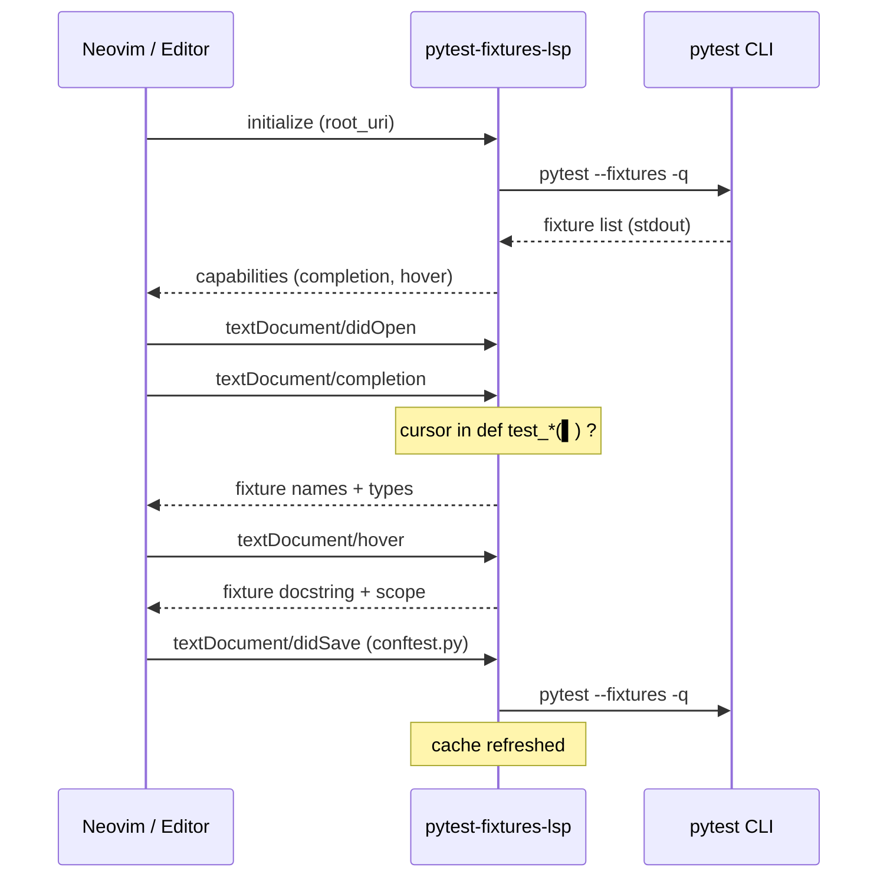
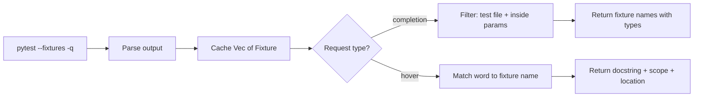

# pytest-fixtures-lsp

LSP server that provides autocomplete and hover documentation for [pytest](https://pytest.org) fixtures in your test files.

Built in Rust with [tower-lsp-server](https://github.com/tower-lsp-community/tower-lsp-server).

## Features

- **Completion** — suggests available pytest fixtures when typing function parameters in `test_*.py` / `*_test.py` files
- **Hover** — shows fixture scope, return type, docstring, and source location
- **Auto-refresh** — reloads fixtures when `conftest.py` is saved

## Architecture



## How it works



Each `Fixture` contains:

| Field | Source |
|-------|--------|
| `name` | fixture function name |
| `scope` | `function`, `class`, `module`, `session` |
| `return_type` | extracted from docstring (if annotated) |
| `docstring` | indented lines after fixture header |
| `location` | file path from pytest output |

## Installation

### Build from source

```bash
cargo install --path .
```

Or download a release binary (coming soon).

### Neovim setup

Add to your LSP config (`after/lsp/pytest_fixtures.lua`):

```lua
return {
  cmd = { 'pytest-fixtures-lsp' },
  filetypes = { 'python' },
  root_dir = function(bufnr, on_dir)
    local root = vim.fs.root(bufnr, { 'pyproject.toml', 'setup.py', 'conftest.py' })
    if root then on_dir(root) end
  end,
}
```

Enable it:

```lua
vim.lsp.enable('pytest_fixtures')
```

## Requirements

- `pytest` available in `PATH` (or in your project's virtualenv)
- Rust toolchain (for building from source)

## License

MIT
