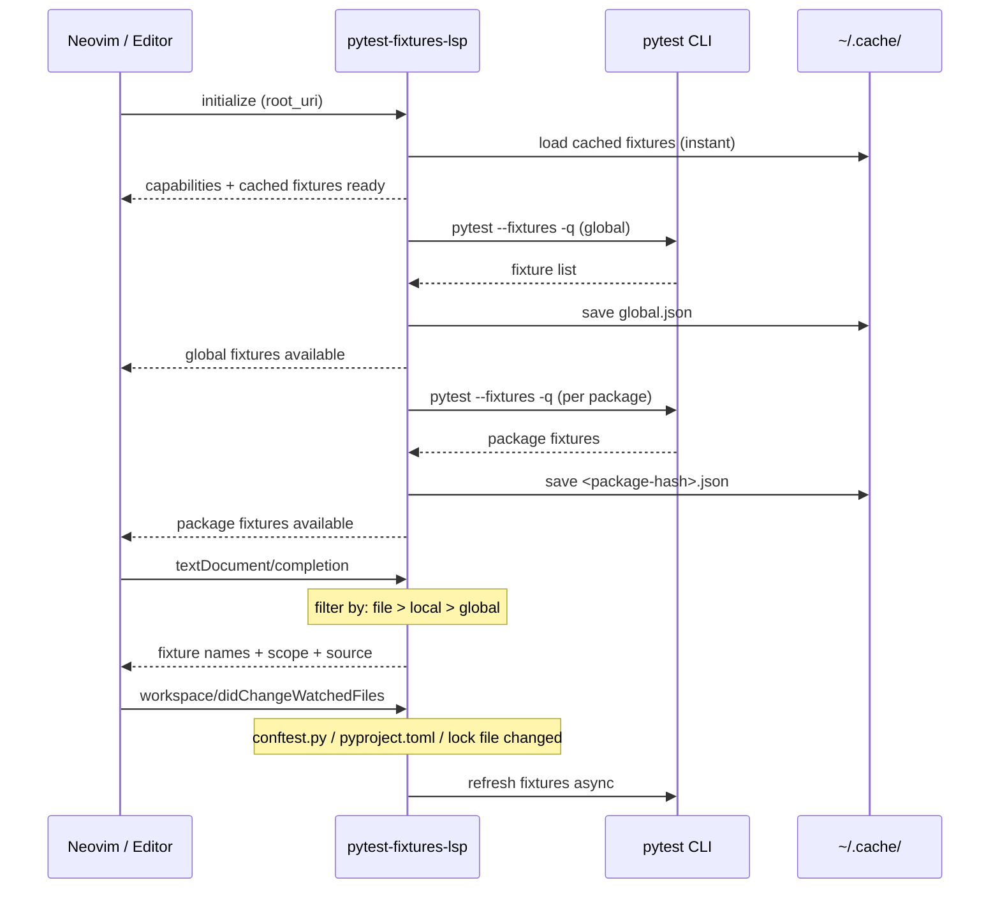
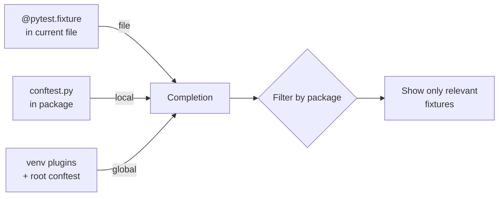

# pytest-fixtures-lsp

LSP server that provides autocomplete and hover documentation for [pytest](https://pytest.org) fixtures in your test files.

Built in Rust with [tower-lsp-server](https://github.com/tower-lsp-community/tower-lsp-server).

## Features

- **Completion** — suggests available pytest fixtures in `test_*.py` / `*_test.py` files
- **Hover** — shows fixture scope, return type, docstring, and source location
- **Multi-source discovery** — fixtures from global venv, local packages, and inline `@pytest.fixture` in current file
- **Package-scoped filtering** — only shows fixtures relevant to the current package (global + local + file)
- **Auto-refresh** — watches `conftest.py`, `pyproject.toml`, and lock files for changes
- **Disk cache** — instant startup from cache, background refresh
- **Project type detection** — supports uv, poetry, pipenv, venv, and system pytest

## Architecture



## Fixture Sources



| Source | How detected | Label | Priority |
|--------|-------------|-------|----------|
| **file** | `@pytest.fixture` in current buffer | `pytest [function][file]` | highest |
| **local** | `pytest --fixtures` from sub-package | `pytest [scope][local]` | medium |
| **global** | `pytest --fixtures` from project root | `pytest [scope][global]` | lowest |

## Project Type Detection

| Strategy | Marker | Command |
|----------|--------|---------|
| uv | `uv.lock` | `uv run pytest --fixtures -q` |
| poetry | `poetry.lock` | `poetry run pytest --fixtures -q` |
| pipenv | `Pipfile.lock` | `pipenv run pytest --fixtures -q` |
| venv | `.venv/bin/pytest` | direct execution |
| system | fallback | `pytest --fixtures -q` |

Detection priority: uv → poetry → pipenv → venv → system.

## Cache Structure

```
~/.cache/pytest-fixtures-lsp/
  └── <project-hash>/
      ├── global.json           # fixtures from project root
      ├── <pkg-hash-1>.json     # fixtures from sub-package 1
      └── <pkg-hash-2>.json     # fixtures from sub-package 2
```

- Per-source files — no race conditions on writes
- Loaded on startup for instant completion
- Refreshed in background after startup
- Updated on `conftest.py` / `pyproject.toml` / lock file changes

## Installation

### Build from source

```bash
cargo install --path .
# or
cargo build --release
cp target/release/pytest-fixtures-lsp ~/.local/bin/
```

### Download release binary

Check [Releases](https://github.com/kornicameister/pytest-fixtures-lsp/releases) for pre-built binaries (linux-x64, macos-arm64, macos-x64).

### Neovim setup

`after/lsp/pytest_fixtures.lua`:

```lua
return {
  cmd = { 'pytest-fixtures-lsp' },
  filetypes = { 'python' },
  root_dir = function(bufnr, on_dir)
    local root = vim.fs.root(bufnr, { 'uv.lock', '.venv', 'pyproject.toml', 'setup.py' })
    if root then on_dir(root) end
  end,
}
```

Enable it in your LSP config:

```lua
vim.lsp.enable('pytest_fixtures')
```

## File Watching

The server automatically watches for changes to:
- `**/conftest.py` — new/modified fixture definitions
- `**/pyproject.toml` — dependency changes
- `uv.lock` / `poetry.lock` / `Pipfile.lock` — installed packages

Changes trigger an async fixture refresh + cache update.

## Requirements

- `pytest` available via your project's package manager (uv, poetry, etc.) or in PATH
- Rust toolchain (for building from source)

## License

MIT
